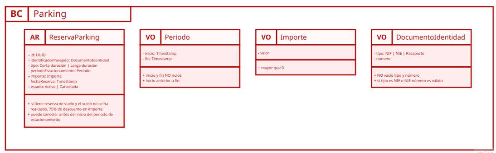

# Encaje práctico — Práctica 3 (CQRS)

🛠️ Práctica 3 — Aplicando CQRS en UMUFly

## 🎯 Objetivo

Aplicar CQRS de forma incremental sobre la aplicación UMUFly (ya estructurada con DDD + Arquitectura Hexagonal), separando claramente los casos de uso de lectura (Queries) y los casos de uso de escritura (Commands), sin modificar la funcionalidad existente.

Al finalizar la práctica, deberíamos haber refactorizado el código para que:

Las lecturas estén modeladas como Queries.

Las escrituras estén modeladas como Commands.

Los controllers REST solo adapten HTTP → Command/Query.

La lógica viva en Handlers (capa de aplicación).

⚠️ En esta práctica no se introducen eventos. Eso se trabajará en el Tema 4.

## 🧩 Punto de partida

Partimos del proyecto UMUFly con Arquitectura Hexagonal completa (fin del Tema 2).
En el código actual existen casos de uso del tipo UseCase que mezclan lecturas y escrituras.

## 📌 Hito 0— Identificar Commands y Queries

Analiza el código y clasifica los casos de uso existentes en:

Queries (lectura):

Ejemplo: obtener listado de vuelos

Commands (escritura):

Ejemplo: solicitar reserva de vuelo

📎 Resultado esperado

ANTES:

GestionarVuelosUseCase

AHORA:

ObtenerVuelos

ListarVuelos

ANTES:

GestionarReservaUseCase

AHORA:

creaReservas

CancelarReservas

ObtenerReservas

ListarReservas

## 📌 Hito 1— Crear estructura

Estructurar los paquetes para que tengan el formato adecuado según la nomenclatura definida y los comandos y queries obtenidos.

📎 Resultado esperado

Tenemos:

es.um.atica.umufly.vuelos.application.usecase.reservas

Desglosamos:

es.um.atica.umufly.vuelos.application.usecase.crearreservas

es.um.atica.umufly.vuelos.application.usecase.cancelarreservas

es.um.atica.umufly.vuelos.application.usecase.obtenerreservas

es.um.atica.umufly.vuelos.application.usecase.listarreservas

Tenemos:

es.um.atica.umufly.vuelos.application.usecase.vuelos

Desglosamos:

es.um.atica.umufly.vuelos.application.usecase.obtenervuelos

es.um.atica.umufly.vuelos.application.usecase.listarvuelos

## 📌 Hito 2 — Crear objetos Command y Query (Y los handlers asociados)

Para cada caso de uso identificado:

Crea una clase <Nombre>CQRS:

<Nombre>Query para lecturas

<Nombre>Command para escrituras

Estas clases:

No contienen lógica.

Solo encapsulan los datos necesarios para el caso de uso.

Para cada Command/Query:

Crea su Handler correspondiente en la capa de aplicación:

<Nombre>QueryHandler

<Nombre>CommandHandler

Mueve la lógica de los antiguos UseCase a los Handlers.

Asegúrate de que:

Las Queries no modifican estado.

Los Commands orquestan la escritura y validan invariantes a través del dominio.

📎 Resultado esperado

creaReservas

creaReservasCommand

creaReservasCommandHandler

CancelarReservas

CancelarReservasCommand

CancelarReservasCommandHandler

ObtenerReservas

ObtenerReservasQuery

ObtenerReservasQueryHandler

ListarReservas

ListarReservasQuery

ListarReservasQueryHandler

Desglosamos:

ObtenerVuelos

ObtenerVuelosQuery

ObtenerVuelosQueryHandler

ListarVuelos

ListarVuelosQuery

ListarVuelosQueryHandler

## 📌 Hito 3 — Separar conceptualmente puertos de lectura y escritura

Revisa los puertos (interfaces) de la capa de aplicación:

Identifica qué métodos son de lectura y cuáles de escritura.

Asegúrate de que:

Los QueryHandlers solo dependen de puertos de lectura.

Los CommandHandlers dependen de puertos de escritura (y de lectura solo para validar invariantes).

💡 Fijaos: el Command orquesta cosas; la Query compone información para consumo.

Por ejemplo, el puerto “mezclado” ReservasVueloRepository en:

ReservasVueloReadRepository

findReservaIdByVueloIdAndPasajero(...)

countReservasByIdVueloAndPasajero(...)

ReservasVueloWriteRepository

persistirReserva(...)

persistirFormalizacionReserva(...)

📎 Resultado esperado

Separar los puertos en puertos de lectura y escritura:

VuelosRepository -> VuelosReadRepository

findVuelos(...)

findVuelo(...)

plazasDisponiblesEnVuelo(...)

ReservasVueloRepository --> ReservasVueloReadRepository

findReservasIdByVueloIdAndPasajero(...)

findReservaIdByVueloIdAndPasajero(...)

countReservasByIdVueloAndPasajero(...)

findReservaById(…)

findReservas(…)

ReservasVueloRepository --> ReservasVueloWriteRepository

persistirReserva(...)

persistirFormalizacionReserva(...)

cancelReserva(…)

FormalizacionReservasVueloPort --> ReservasVueloWritePort

formalizarReservaVuelo(...)

cancelarReservaVuelo(…)

## 📌 Hito 4 — Adaptar controladores REST

Refactoriza los controladores REST para que:

No contengan lógica de negocio.

Se limiten a:

Adaptar la petición HTTP a un Command/Query.

Delegar en el Handler correspondiente.

Adaptar la respuesta al DTO REST.

📎 Resultado esperado

## 📌 Hito 5 — Modelar e implementar el contexto de “parking”

Ahora nos toca aplicar lo aprendido hasta ahora con un contexto un poco más pequeño. Empecemos a realizar el contexto del parking, siguiendo los pasos necesarios para ello.

Parte analítica:

Detectar lenguaje ubicuo.

Identificar casos de uso.

Separar en comandos y queries.

Definir el modelo del dominio.

Implementación:

Crear estructura de paquetes del contexto.

Implementar el modelo del dominio.

Implementar comandos y queries

Implementar handlers de los comandos y queries identificados

Implementar puertos

Implementar adaptadores, assembler, mappers y entidades de datos.

Implementar controladores Rest.

📎 Resultado esperado

Detectar lenguaje ubicuo.

ReservaParking: reserva de estacionamiento para un pasajero en un periodo.

Periodo: intervalo de tiempo [inicio, fin] del estacionamiento.

TipoEstacionamiento: CORTA_DURACION / LARGA_DURACION.

Importe: cantidad monetaria total de la reserva.

Descuento: 75% si el pasajero tiene reservas de vuelo y el vuelo asociado no se ha realizado.

EstadoReservaParking: ACTIVA / CANCELADA.

Identificar casos de uso.

Comandos:

SolicitarReservaParking

CancelarReservaParking

Queries

ObtenerReservasParkingDePasajero

ObtenerDetalleReservaParking

Definir el modelo del dominio

ReservaParking (AR)

Periodo (VO)

Importe (VO)

DocumentoIdentidad (VO)

## 🎓 Reflexión final

¿Qué ha cambiado en la estructura del código?

¿Qué partes ahora resultan más fáciles de entender?

¿Qué habría pasado si hubiéramos seguido metiendo lógica en un único UseCase?

¿Dónde crees que encajarán los eventos en el siguiente tema?