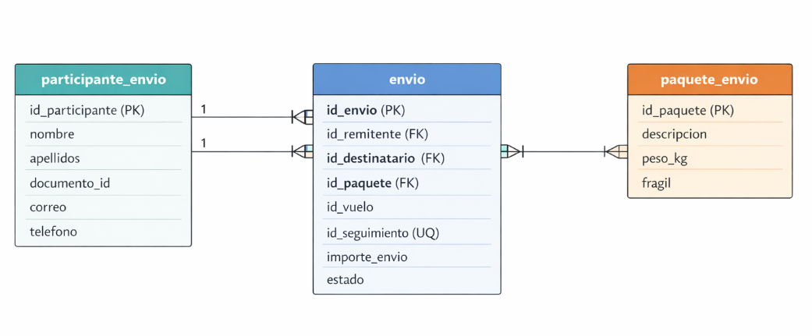

# Muchovuelo paquetería

El director general de MuchoVuelo, satisfecho con el sistema de reservas de vuelos y gestión de parking desarrollado, ha solicitado la incorporación de una **nueva línea de negocio**: el envío de paquetes mediante mensajería aérea. Esta funcionalidad se implantará en la misma API desarrollada para las reservas de vuelos y gestión del parking.

El objetivo es permitir que cualquier usuario pueda facturar un paquete, asociarlo a un vuelo disponible y hacer seguimiento de su envío hasta la ciudad destino.
Tras hablar con el jefe del departamento de mensajería, se nos transmitió lo siguiente: 

>Os cuento cómo funciona el tema de la carga. En MuchoVuelo ofrecemos a particulares y empresas la posibilidad de enviar paquetes **en la bodega de nuestros aviones**. Cuando el remitente entre en la aplicación, debe ver un listado con todos los vuelos disponibles. De cada vuelo queremos mostrar los mismos datos que mostramos para las reservas de vuelo. 
>
>No vamos a valorar un límite de carga, ya que no esperamos que nuestros aviones se llenen nunca.
Por su parte, el destinatario retirará su paquete de las taquillas del aeropuerto, destinadas a tal fin, cuando éste haya llegado.
>
>El remitente elegirá un vuelo disponible, es decir que no esté cancelado o iniciado, e iniciará el proceso de facturación del paquete. En ese momento necesitamos que nos proporcione sus datos: **nombre, apellidos, documento de identidad, correo electrónico y teléfono de contacto**. También necesitamos los datos del destinatario que serán los mismos. Y, por supuesto, los datos propios del paquete: **descripción del contenido, peso en kilogramos y si es frágil o no**.
>
>El precio se calcula automáticamente: dos euros con cincuenta céntimos por kilogramo si el paquete no es **frágil**, y cuatro euros por kilogramo si lo es.
Cuando se completa la facturación, habrá que asignarle un **número de seguimiento único** para que el remitente pueda consultar el estado de su envío en cualquier momento. El paquete puede estar en uno de estos estados: **facturado, en tránsito o entregado**. La aplicación debe permitir ver un listado con todos los envíos realizados por un remitente.

Con toda esta información deberemos ampliar la API REST para que cubra esta funcionalidad. En este caso se tendrá acceso al esquema de base de datos final directamente. Las tablas ya estarán creadas y sólo debemos adaptar nuestra API a ese esquema.

### Condiciones de calidad

Para asegurar que nuestra API cumple unos mínimos estándares de calidad implementaremos también lo siguiente:

* Utilizar el mecanismo de seguridad usando token JWT ya implementado en la aplicación
* Crear una suite de test de cucumber que contemplen algunos de los escenarios que aborda la solución

### Información de interes

#### Esquemade base de datos
El esquema de base de datos disponible de las siguientes tablas ya creadas

**Tabla participante_envio**: Identifica tanto a remitente como a destinatario

    CREATE TABLE muchovuelo_participante_envio (
    id_participante     VARCHAR2(100) PRIMARY KEY,
    nombre              VARCHAR2(100) NOT NULL,
    apellidos           VARCHAR2(150) NOT NULL,
    numero_documento    VARCHAR2(15) NOT NULL,
    tipo_documento      VARCHAR(2) NOT NULL,
    email               VARCHAR2(250) NOT NULL,
    telefono            VARCHAR2(30),
    tipo_participante   VARCHAR2(20) NOT NULL,
    CONSTRAINT chk_tipo_participante CHECK (tipo_participante IN ('remitente', 'destinatario'))
);

**Tabla paquete_envio**: Identifica el paquete que se va a enviar

    CREATE TABLE muchovuelo_paquete_envio (
    id_paquete      VARCHAR2(100) PRIMARY KEY,
    descripcion     VARCHAR2(500) NOT NULL,
    peso_kg         NUMBER(8,2) NOT NULL,
    fragil          VARCHAR(1) DEFAULT 'N' NOT NULL,
    CONSTRAINT chk_paquete_fragil CHECK (fragil IN ('S','N'))
);

**Tabla muchovuelo_envio**: Relaciona el paquete con el remitente y el destinatario

    CREATE TABLE muchovuelo_envio (
    id_envio            VARCHAR2(100) PRIMARY KEY,
    id_remitente        VARCHAR2(100) NOT NULL,
    id_destinatario     VARCHAR2(100) NOT NULL,
    id_paquete          VARCHAR2(100) NOT NULL,
    id_vuelo            VARCHAR2(50) NOT NULL,
    id_seguimiento      VARCHAR2(50) NOT NULL,
    importe_envio       NUMBER(10,2) NOT NULL,
    estado              VARCHAR2(20) NOT NULL,

    CONSTRAINT fk_envio_remitente
        FOREIGN KEY (id_remitente)
        REFERENCES muchovuelo_participante_envio(id_participante),

    CONSTRAINT fk_envio_destinatario
        FOREIGN KEY (id_destinatario)
        REFERENCES muchovuelo_participante_envio(id_participante),

    CONSTRAINT fk_envio_paquete
        FOREIGN KEY (id_vuelo)
        REFERENCES muchovuelo_vuelo(id),
        
    CONSTRAINT fk_envio_vuelo
        FOREIGN KEY (id_paquete)
        REFERENCES muchovuelo_paquete_envio(id_paquete),

    CONSTRAINT uq_envio_seguimiento
        UNIQUE (id_seguimiento),

    CONSTRAINT chk_importe_envio
        CHECK (importe_envio >= 0),

    CONSTRAINT chk_estado_envio
        CHECK (estado IN ('FACTURADO', 'EN_TRANSITO', 'ENTREGADO'))
);

#### Datos ya existentes
Los datos que ya existen en base de datos son los siguientes

**Usuarios**
* prueba@um.es Marta Martinez Cuadrado
* rodrigo@um.es Rodrigo Ortuño Ruz
* cecilia@um.es Cecilia Sanchez Lopez
* aitor@um.es Aitor Campillo Saez